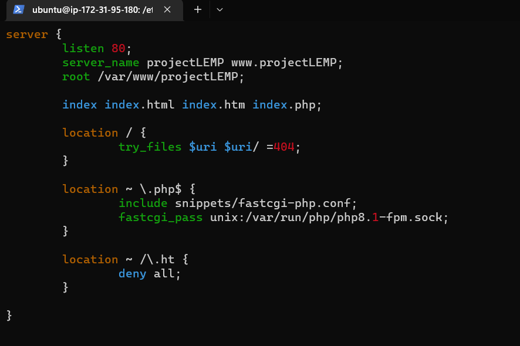

## Installation of NGINX Web Server
### Install NGINX
* sudo apt update
* sudo install nginx
### Check if nginx server is running
* sudo systemctl status nginx

### Test website on port 80
* curl *http://localhost:80*

### Test website using public ip address
* access url http://3.95.167.225/

### Check website publick ip
* curl -s http://169.254.169.254/latest/meta-data/public-ipv4

## Install MYSQL Server
* sudo apt install mysql-server
* sudo mysql
### Run security scrip that come pre-installed with MySQL
* ALTER USER 'root" @'localhost' IDENTIFIED WITH mysql_native_password BY 'PassWord.1';
* exit
### Start interactive script to secure installation
* sudo mysql_secure_installation
### Login as root with password
* sudo mysql -p

### Exit mysql 
* exit

## Install PHP
### Install 2 packages at once
* sudo apt install php-fpm php-mysql
### Check php version
* php -v

## Configure NGINX to use PHP processor
## Create a root web directory for projectlemp
* sudo mkdir /var/www/projectLEMP
sudo chown -R $USER:$USER /var/www/projectLEMP
### Create website config file
* sudo /etc/nginx/sites-available/projectLEMP

### Activate the newly configured site by creating a soft-link
* sudo ln -s /etc/nginx/sites-available/projectLEMP /etc/nginx/sites-enabled/
### Test config file for error
* sudo nginx -t

### If there were no errors, then disable the default nginx cinfig host
* sudo unlink /etc/nginx/sites-enabled/default
### Reload nginx to apply changes
* sudo systemctl reload nginx
### Send data in the website index.html file as bellow:
* sudo echo 'Hello LEMP from hostname' $(curl -s http://169.254.169.254/latest/meta-data/public-hostname) 'w
ith public IP' $(curl -s http://169.254.169.254/latest/meta-data/public-ipv4) > /var/www/projectLEMP/index.html

## Testing PHP with nginx
### create a php page
* sudo vi /var/www/projectLEMP/index.php
### <?php
phpinfo();

### Delete index.php page
* sudo rm /var/www/projectLEMP/index.php

## Retrieving data from MySQL Database with php
### Create a new database and new user
* sudo mysql
* mysql> CREATE DATABASE 'example_database';
### Create a new use and grant him full priviledges on the database
mysql> CREATE USER 'example_user'@'%' IDENTIFIED WITH mysql_native_password BY 'password';
### Give the new user permission over the *example_database* database
mysql> GRANT ALL ON *example_database*.* TO '*example_user'@'%';
mysql> exit
### Test if the new user has permissions by logging in to the MySQL
* mysql -u *example_user* -p
### mysql> show DATABASES;

Create a todo_list
mysql> CREATE TABLE example_database.todo_list (

CREATE TABLE example_database.todo_list (
mysql>     item_id INT AUTO_INCREMENT,
mysql>     content VARCHAR(255),
mysql>     PRIMARY KEY(item_id)
mysql> );

mysql> INSERT INTO example_database.todo_list (content) VALUES ("My first important item");
mysql>  SELECT * FROM example_database.todo_list;

### Create a php script that will connect to MySQL
* nano /var/www/projectLEMP/todo_list.php

### Access website using /todo_list.php
* http://2.2.3.4/todo_list.php

### Nginx site is up and running